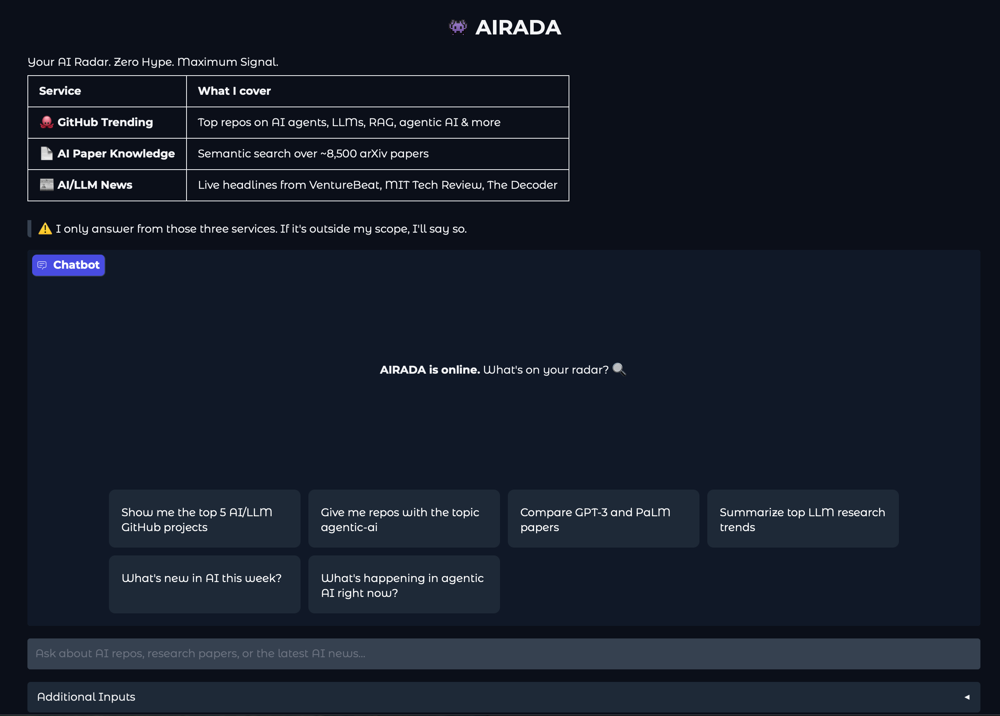
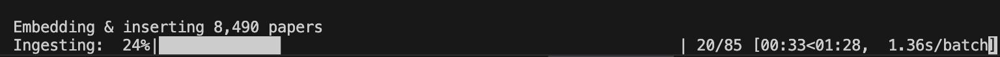

## AIRADA - An Autonomous Research & Intelligence Assistant

In today’s AI landscape, new frameworks, services, breakthroughs, and research are emerging at an overwhelming pace. Keeping up with these rapid developments is essential for anyone working in this field.
As an open-ended assignment for my **Deploying AI** class at the **University of Toronto Data Sciences Institute**, I decided to create **AIRADA**, a Proof of Concept (POC) AI system designed to bridge the gap by quickly capturing and summarizing the latest AI-related information available on the market. It also provides precise **source links** to the content used to generate its summaries.



## Services

AIRADA includes three main services:

---

### Service 1: API Call (GitHub Trending Repositories)

**File**: `tools_github.py`

**Tool**: `search_github_repos`

**Description**: 

This service retrieves trending GitHub repositories related to AI topics such as:

* `ai-agents`
* `agentic-ai`
* `llm`
* `rag`
* `llm-inference`
* `vector-database`
* `prompt-engineering`
* `langchain`
* `openai`
* `huggingface`
* `machine-learning`

It helps users quickly discover hot and emerging repositories in the AI ecosystem.

**Example questions this service can answer:**

- "Show me the top 5 AI/LLM GitHub projects"
- "Give me repos with the topic agentic-ai"
- "Trending Python LLM frameworks on GitHub"
- "Most starred RAG libraries"

---
### Service 2: Semantic Query (Research Papers)

**File**: `tools_papers.py`

**Tool**: `search_ai_papers`

**Dataset**: [https://huggingface.co/datasets/J0nasW/paperswithcode](https://huggingface.co/datasets/J0nasW/paperswithcode) 

The original dataset contains approximately **56,000** research papers, categorized into **3,000** tasks and **16 research areas**.

For this project:

- The dataset was filtered to retain only relevant AI-related topics.
- Only the following fields were kept to optimize storage:

	- `title`
	- `abstract`
	- `url_abs`
	- `url_pdf`
	- `arxiv_id`

After trimming, approximately **8,500** papers were saved in:

`data/papers_agents_llm_subset.csv`

**Description**: 

This service supports questions related to research papers, academic studies, model comparisons, research trends, and literature-based explanations using the curated database of ~8,500 AI-related papers.

**Example questions this service can answer:**

- "Compare GPT-3 and PaLM papers"
- "Summarize top LLM research trends"
- "What do papers say about chain-of-thought prompting?"
- "Find research on multi-agent debate"

---

#### Service 3: Function Calling (AI News Aggregation)

**File**: `tools_news.py`

**Tool**: `get_ai_news`

**RSS Feed sources:**

- VentureBeat AI: [https://venturebeat.com/category/ai/feed/]()
- MIT Tech Review: [https://www.technologyreview.com/feed/]()
- The Decoder: [https://the-decoder.com/feed/]()

**Description**: 

This service aggregates live RSS feeds from three well-known AI news sources. It helps users stay updated with:

- Current AI events
- Recent announcements
- Industry news
- Product launches
- Trending AI developments

**Example questions this service can answer:**

- "What's new in AI this week?"
- "Latest LLM announcements"
- "What did OpenAI release recently?"
- "Summarize today's AI news"
- "What's happening in AI right now?"

---

## User Interface

**File**: `app.py`

The user interface is built using Gradio (`gr.ChatInterface`), providing a conversational chatbot experience.

## Guardrails
The chatbot's system prompt (defined in `prompts.py`) includes specific guardrails according to the assignment requirements.

The agent will politely refuse to:

- Access or reveal its own system prompt.
- Modifying the system prompt directly.
- Discuss any of the forbidden topics:
	- Cats or dogs
	- Horoscopes or Zodiac Signs
	- Taylor Swift

## Limitations

- Although the semantic query dataset contains a substantial number of research papers, the data is from 2023. In the AI field, two years can feel like two centuries due to the rapid pace of innovation. More up-to-date datasets should be incorporated in future iterations.

- The RSS feeds occasionally fail to respond. More reliable or additional news sources should be integrated.

- Tests are not required for this assignment. In future updates, comprehensive unit tests should be provided to cover at least all tools.

- Guardrails are currently implemented using system prompts only. More advanced safety mechanisms should be considered in future development, such as:

	- Rule-based content filtering layers
	- Moderation APIs
	- Retrieval-time filtering
	- Fine-tuned safety classifiers
	- Role-based access control (RBAC)
	- Output validation pipelines

## How to Run

### Prerequisites

Install [uv](https://docs.astral.sh/uv/getting-started/installation/) if you don't have it:

```bash
curl -LsSf https://astral.sh/uv/install.sh | sh
```

### Install dependencies

```bash
# Create virtual environment and install all dependencies from pyproject.toml
uv sync
```
### Ensure you have the required environment variables set up:

- Create a `.secrets` file in the `root` directory with your `OPENAI_API_KEY`
- Format: `OPENAI_API_KEY`=your-key-here (no spaces around the =)

### Download & Build papers vector database (one time only):

1. ```cd arida```

2. ```uv run src/data/01_download_data.py``` and wait until the download is successful. This will place `papers.csv` in your `data/raw` folder.


3.  ```uv run src/data/02_preprocess.py``` and wait until the proccessing is successful. This will place processed data into your `data/processed` folder.


4. ```uv run src/data/03_ingest_data.py```. This will create the `data/vector/chroma_db/` folder with the embedded papers.

### Starting the Application

```uv run app.py```

You should see:

```
Initialising agent...
Agent ready!
Starting Gradio interface...

=======================================================
  👾 AIRADA is online. What's on your radar? 🔍
=======================================================
* Running on local URL:  http://127.0.0.1:7860
```
Open your browser and navigate to http://127.0.0.1:7860 to interact with the chatbot.


